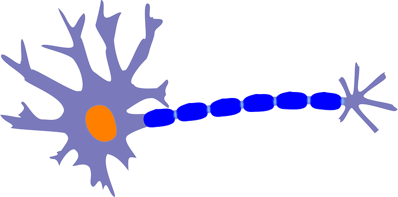

# Hola Neurona

Este proyecto implementa ejemplos de neuronas con diferentes configuraciones utilizando Python y Streamlit.

## Contenido

1. [Descripción](#descripción)
2. [Estructura del Proyecto](#estructura-del-proyecto)
3. [Requisitos](#requisitos)
4. [Instrucciones de Uso](#instrucciones-de-uso)
5. [Agradecimientos](#agradecimientos)

## Descripción

La aplicación "Hola Neurona" proporciona ejemplos interactivos de neuronas con diferentes configuraciones. Puedes visualizar y experimentar con neuronas de una, dos y tres entradas, así como sesgo.

## Estructura del Proyecto

- `app.py`: Contiene el código principal de la aplicación con las implementaciones de las neuronas.
- `images/`: Carpeta que contiene imágenes utilizadas en la aplicación.
- `README.md`: Este archivo.

## Requisitos

Asegúrate de tener instalados los siguientes paquetes antes de ejecutar la aplicación:

- `pip install streamlit numpy`

## Instrucciones de Uso

1. Clona el repositorio:

- `git clone https://github.com/tuusuario/turepositorio.git`
- `cd turepositorio`

2. Instala los requisitos:
- `pip install -r requirements.txt`

3. Ejecuta la aplicación:
- `streamlit run app.py`

## Agradecimientos

Gracias por utilizar la aplicación "Hola Neurona". Si tienes alguna pregunta, puedes contactar al autor:

Jesús Cánovas Barqueros
Email: jesuscanovas3w@gmail.com.com

